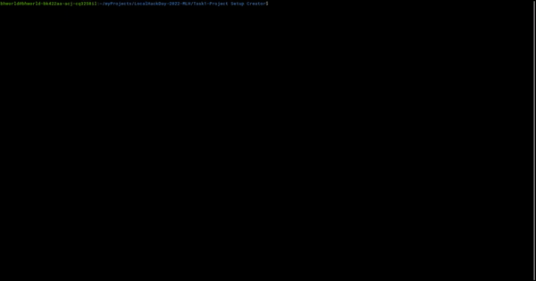

<div align="center">

# Project Setup Creator
Helps in setting up project enviornment for any project with a single command.



</div>

## Instructions for use

- [Setting the Editor](#setting-the-editor)
- [Create a new setup](#create-a-new-setup)
- [Edit the existing setup](#edit-the-existing-setup)
- [Run the setup](#run-the-setup)
- [Delete the setup](#delete-the-setup)
- [Show the list of setups](#show-the-list-of-setups)
- [Show the editor](#show-the-editor)
- [Show the help](#show-the-help)

### Setting the Editor

```bash
python3 main.py -se <editor>
```

- This will check the existence of editor, and if it is not found, it will prompt you to install it.
- If commands related to setting up the editor or for editing the existing setup file are run without setting the editor, the program will check for few editors and prompt you if none of the editors are found.

### Create a new setup

```bash
python3 main.py -c <project name>
```

- This will create a new setup with the name given as argument.
- It will open the file in a text editor from where you can add the required command you need to set up the environment for the project.

### Edit the existing setup

```bash
python3 main.py -e <project name>
```

- This will open the setup file in the editor set by the user.
- If the setup file is not found, it will prompt you to create a new setup.

### Run the setup

```bash
python3 main.py <project name>
```

- This will run the command stored with the setup name.

### Delete the setup

```bash
python3 main.py -d <project name>
```

- This will delete the setup file.

### Show the list of setups

```bash
python3 main.py -l
```

- This will show the list of setups.

### Show the editor
```bash
python3 main.py -editor
```

- This will show the editor set by the user.

### Show the help

```bash
python3 main.py -h
```

- This will show the help.
