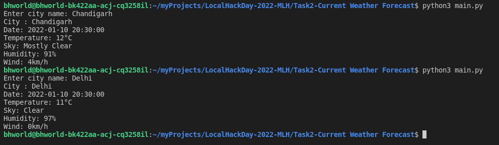

<div align="center">

# Project Setup Creator
Helps in setting up project enviornment for any project with a single command.



</div>

## Instructions for use

- [Installing Requirements](#installing-requirements)
- [Runing Script](#runing-script)

### Installing Requirements

#### Windows

```bash
pip3 install -r requirements.txt
```
#### Linux

```bash
pip3 install -r requirements.txt
```

### Running Script

```bash
python3 main.py
```